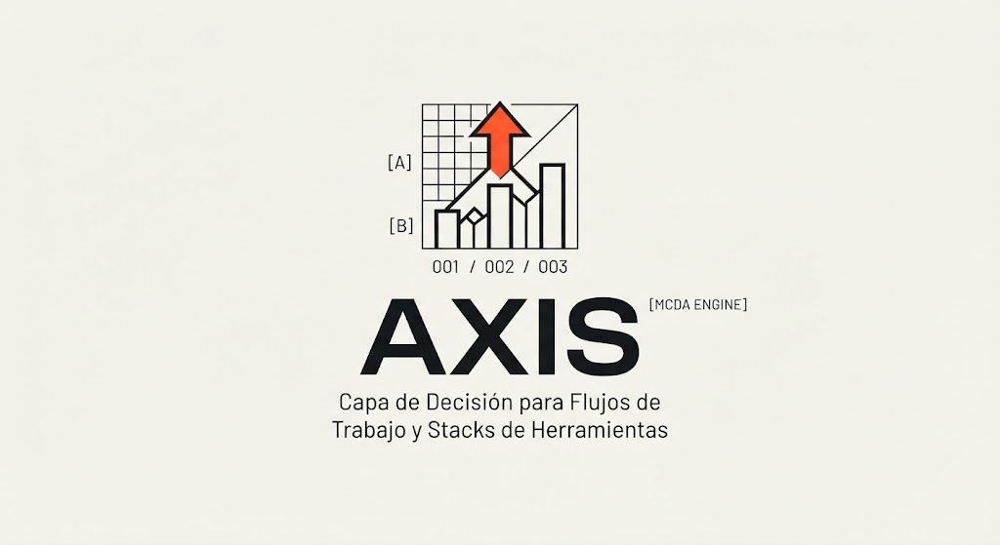
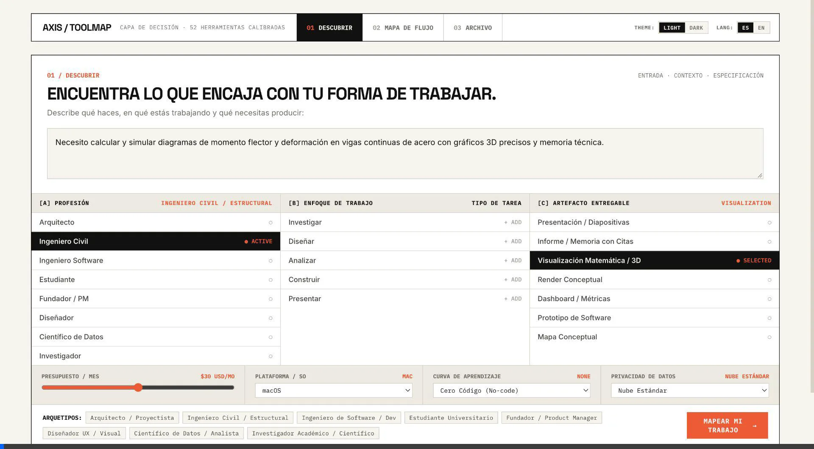
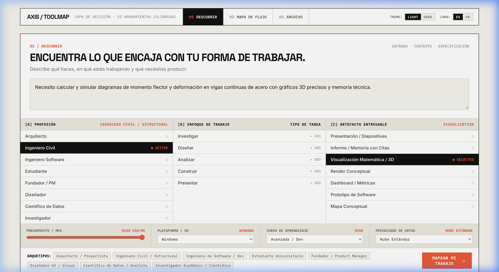
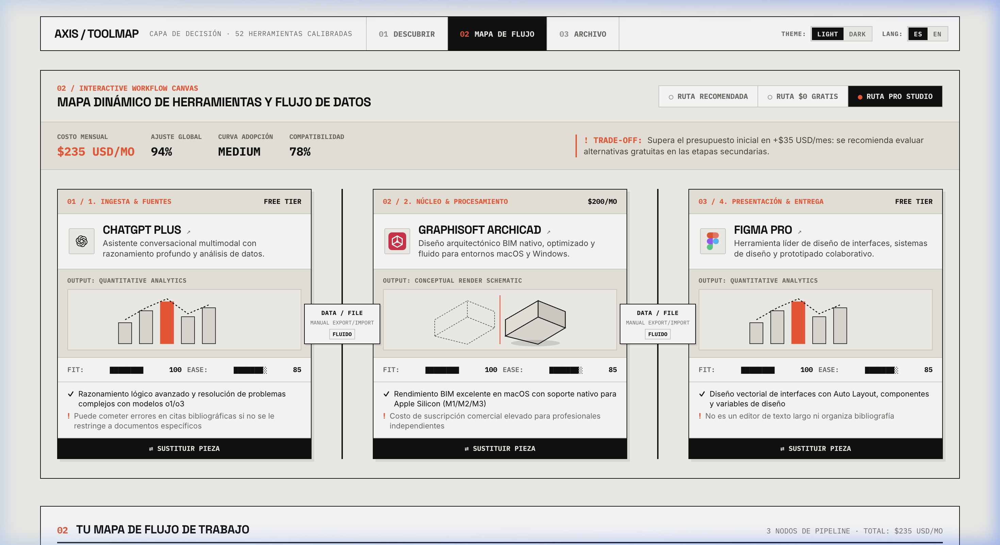
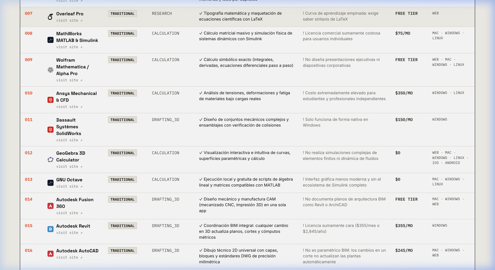
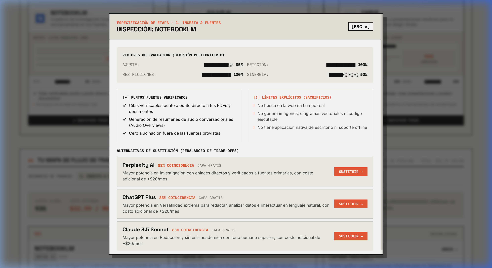

<p align="center">
  
  <br />
  <strong style="font-size: 1.4rem; letter-spacing: -0.02em;">AXIS [MCDA ENGINE]</strong>
  <br />
  <code style="color: #FF4B22; font-weight: 700;">001 / 002 / 003 · DECISION LAYER</code>
</p>

# AXIS — Capa de Decisión para Flujos de Trabajo y Stacks de Herramientas

> **De directorios genéricos de IA a un motor de decisión multicriterio (MCDA) centrado en personas, entregables, soberanía de datos y restricciones operativas reales.**



AXIS es una plataforma técnica y motor de decisión diseñado para resolver el problema estructural del ecosistema de software contemporáneo: la saturación de herramientas y la ausencia de criterio técnico para articular flujos de trabajo coherentes.

En lugar de limitarse a listar herramientas aisladas, AXIS evalúa de forma cruzada la **profesión del usuario**, el **enfoque de trabajo**, el **artefacto técnico entregable**, el **presupuesto mensual ($/mes)**, la **tolerancia de curva de aprendizaje**, el **sistema operativo** y la **soberanía de datos** para sintetizar pipelines de trabajo balanceados entre software comercial consolidado, herramientas de código abierto ($0) y plataformas nativas en inteligencia artificial.

---

## 1. El Problema que Resuelve AXIS

### El Fallo de los Directorios Tradicionales
Los directorios de software e IA convencionales (estilo "Top 100 AI Tools") fallan por tres razones fundamentales:
1. **Descontextualización Total:** Presentan listas alfabéticas o por popularidad sin entender si el usuario es un arquitecto que necesita emitir planos IFC acotados o un docente que necesita rúbricas de evaluación pedagógica.
2. **Aislamiento de Etapas:** Sugieren aplicaciones sueltas sin considerar la interoperabilidad formativa ni cómo viaja el dato entre una herramienta y la siguiente.
3. **Ceguera Financiera y Operativa:** Ignoran las restricciones duras de presupuesto, curvas de aprendizaje prohibitivas y requisitos de privacidad local o cumplimiento normativo.

| Dimensión de Análisis | Directorios Tradicionales | AXIS (Decision Layer) |
| :--- | :--- | :--- |
| **Unidad de Decisión** | Herramienta individual aislada | Flujo de trabajo secuencial (Pipeline de 3-4 etapas) |
| **Criterio de Orden** | Popularidad, patrocinio o votos | Puntuación Multicriterio (MCDA) calibrada por entregable |
| **Restricciones Duras** | Filtros básicos de categoría | Filtros estrictos de presupuesto, SO, privacidad y curva |
| **Interoperabilidad** | Inexistente (el usuario adivina formatos) | Conectores **Data Glue** con nivel de fricción y formato |
| **Contextualización** | Lista genérica para todos los perfiles | **Smart Scoping**: adaptación por carrera y entregable |
| **Vocabulario** | Sesgado a desarrollo de software | Vocabulario adaptativo según dominio profesional |

---

## 2. Filosofía de Diseño: Human-Centered Technical Editorial

El diseño de AXIS rechaza deliberadamente las convenciones estéticas infladas de las startups de IA (gradientes morados genéricos, bordes redondeados excesivos, tipografías predeterminadas) y adopta una disciplina rigurosa inspirada en:
- **Estilo Tipográfico Suizo (International Typographic Style):** Retículas estructuradas de 1px, orden asimétrico y la tipografía como elemento primario de jerarquía e información.
- **Brutalismo Técnico Contenido:** Estructuras expuestas, índices numéricos de 3 dígitos (`[001]`, `[002]`), barras de telemetría y especificaciones de ingeniería.
- **Sensación de Instrumento de Precisión:** Interfaz calibrada que evoca consolas de conmutación técnica, racks de laboratorio y matrices de decisión.
- **Regla Estricta:** Cero emojis. Iconografía técnica y glifos vectoriales de precisión.



### Sistema de Tokens y Paleta de Color
- **Modo Claro (Lienzo de Archivo):**
  - Fondo: `#F5F3EC`
  - Superficie: `#FFFFFF`
  - Tinta profunda: `#111111`
  - Tinta secundaria: `#444444`
  - Líneas nítidas: `#D4D1C7`
  - Acento de señal: `#FF4B22` (International Orange)
- **Modo Oscuro (Pizarra Obsidiana):**
  - Fondo: `#101114`
  - Superficie: `#17191E`
  - Tinta nítida: `#F3F1EB`
  - Líneas técnicas: `#2D3039`
  - Acento de señal: `#FF5722`
- **Tipografías:**
  - `Space Grotesk`: Titulares contundentes y encabezados de rack modular.
  - `IBM Plex Mono`: Metadatos, barras de ajuste ASCII, índices numéricos y especificaciones de fricción.
  - `Inter`: Lectura fluida en descripciones, capacidades y evidencias.

---

## 3. Arquitectura del Sistema y Módulos de la Interfaz

La plataforma opera en tres niveles funcionales interconectados de forma reactiva:

```
AXIS / TOOLMAP
├── 01 / DESCUBRIR (Intent Instrument)
│   ├── Entrada de intención en lenguaje natural con presets instantáneos
│   ├── Matriz Suiza 3-Columnas (32 x 32 x 32):
│   │   ├── [A] PROFESIÓN: 32 carreras en 8 macro-dominios con filtros rápidos
│   │   ├── [B] ENFOQUE DE TRABAJO: Smart Scoping adaptado al perfil activo
│   │   └── [C] ARTEFACTO ENTREGABLE: 32 tipos de entregables técnicos normalizados
│   ├── Barra de Restricciones Técnicas: Presupuesto ($0 a $300+/mes), SO, Curva y Privacidad
│   └── Botón de transición directa al Canvas: [ MAPEAR MI TRABAJO → ]
│
├── 02 / MAPA DE FLUJO (Interactive Workflow Canvas)
│   ├── Tríada de Rutas Estratégicas:
│   │   ├── [RUTA RECOMENDADA / RECOMMENDED ROUTE]
│   │   ├── [RUTA $0 GRATIS / $0 FREE ROUTE]
│   │   └── [RUTA PRO STUDIO / PRO STUDIO ROUTE]
│   ├── Barra de Telemetría BOM con Vocabulario Adaptativo por Dominio
│   ├── Grafo Secuencial de Nodos: Racks por etapa con logos SVG sanitizados
│   ├── Conectores "Data Glue": Formatos intercambiados y advertencias de fricción
│   ├── Previsualizaciones de Artefactos: Mallas 3D, Planos, Renders, Cuadernos
│   └── Inspector de Trade-offs y Sustitución Técnica (Modal de Swap)
│
└── 03 / ARCHIVO (Tools Archive & Decision Matrix)
    ├── Catálogo técnico de 90 herramientas calibradas ($0 a $450/mes)
    ├── Logotipos vectoriales oficiales sanitizados con namespace xmlns (WebKit/Safari)
    ├── Filtros por categoría: Investigación, Cálculo, Diseño & 3D, Presentación, Datos, Productividad
    └── Búsqueda en tiempo real por capacidades, limitaciones y lo que NO hace la herramienta
```

---

## 4. Innovaciones Clave

### A. Contextualización Adaptativa por Carrera (Smart Scoping)
Al expandir la matriz a 32 carreras, 32 tareas y 32 entregables, el usuario se enfrenta a 96 dimensiones de decisión. Para evitar la sobrecarga cognitiva:
- **Filtrado Inteligente de Dominio:** Al seleccionar una profesión en la Columna `[A]` (p. ej. *Docente Universitario*), las columnas `[B]` (Enfoque de Trabajo) y `[C]` (Artefacto Entregable) activan automáticamente la pastilla `[RELEVANTES A MI PERFIL]`, mostrando únicamente las tareas y entregables pertinentes a su área disciplinar.
- **Eliminación de Jerga Ajena:** Un docente universitario o un abogado nunca se verá inundado con opciones de ruteo de circuitos impresos (PCB), dinámica de fluidos (CFD) o manifiestos de Kubernetes a menos que lo solicite explícitamente.
- **Exploración Interdisciplinaria:** Mediante la pastilla `[VER TODAS (32)]`, cualquier usuario puede voluntariamente expandir el catálogo completo para flujos cruzados.



### B. Vocabulario Adaptativo por Dominio
La interfaz ajusta su terminología en función de la familia profesional seleccionada:
- **Dominio Humanidades, Educación, Legal y Negocios (`SCIENCE` / `BIZ`):**
  - En lugar de *"DATA GLUE"* → *"COMPATIBILIDAD DE DOCUMENTOS"* (`DOCUMENT INTEROPERABILITY`).
  - En lugar de *"PIPELINE NODES"* → *"HERRAMIENTAS DEL FLUJO"* (`WORKFLOW TOOLS`).
  - En lugar de *"BOM"* → *"PRESUPUESTO ESTIMADO"* (`ESTIMATED BUDGET`).
- **Dominio Ingeniería, AEC, Hard-Tech y Software (`ING`, `AEC`, `TECH`, `DATA`):**
  - Mantiene la terminología rigurosa de ingeniería: *"DATA GLUE"*, *"TELEMETRÍA BOM"*, *"NODOS DE PROCESAMIENTO"*.

### C. Internacionalización Integral (100% Full i18n)
AXIS cuenta con soporte bilingüe integral (`ES` / `EN`) con cero fugas de idioma:
- **Navegación y Cabeceras:** Etiquetas de sección, subíndices, selectores de tema e idioma.
- **Columnas de la Matriz:** Títulos, descripciones de tareas, nombres de entregables, badges de estado (`● ACTIVO` / `● ACTIVE`, `● SELECCIONADO` / `● SELECTED`, `+ AGREGAR` / `+ ADD`).
- **Tríada de Rutas:** `RUTA RECOMENDADA` / `RECOMMENDED ROUTE`, `RUTA $0 GRATIS` / `$0 FREE ROUTE`, `RUTA PRO STUDIO` / `PRO STUDIO ROUTE`.
- **Etapas de Flujo:** `1. Ingesta & Fuentes` / `1. Ingest & Research`, `2. Núcleo & Procesamiento` / `2. Core & Processing`, `3. Estructuración & Refinamiento` / `3. Structuring & Refinement`, `4. Presentación & Entrega` / `4. Presentation & Delivery`.
- **Notas de Trade-off:** Generación sintética en lenguaje natural en ambos idiomas.
- **Data Glue:** Métodos de transferencia (`EXPORTACIÓN / IMPORTACIÓN MANUAL` / `MANUAL EXPORT/IMPORT`, `COPIAR / PEGAR TEXTO` / `COPY / PASTE TEXT`), formatos y niveles de fricción (`FLUIDO` / `SEAMLESS`, `MANUAL`).
- **Archivo de Herramientas:** Badges `NATIVA IA` / `NATIVE AI`, `TRADICIONAL` / `TRADITIONAL`, `CAPA GRATIS` / `FREE TIER`, categorías traducidas y enlaces `visitar sitio ↗` / `visit site ↗`.

---

## 5. Catálogo de 32 Profesiones Indexadas

AXIS agrupa sus 32 arquetipos profesionales calibrados en 8 macro-dominios:

| Macro-Dominio | Código | Profesión Calibrada | Enfoque Típico | Entregable Primario |
| :--- | :--- | :--- | :--- | :--- |
| **AEC & Arquitectura** | `[001]` | Arquitecto Residencial & Urbanista | Modelado 3D, Planimetría, Renders | Planos DWG/PDF, Renders, BIM |
| | `[002]` | Ingeniero Civil / Estructural | Análisis FEM, Planimetría, Esfuerzos | Memoria de Cálculo, Planos |
| | `[003]` | Gerente de Construcción & Obra | Coordinación BIM, Mediciones, RFIs | Cronograma Gantt, Cómputos BOM |
| | `[004]` | Especialista GIS & Topografía | Nubes LiDAR, Modelos DEM, Rasters | Mapa GIS, Trazado Topográfico |
| **Ingeniería & Hard-Tech** | `[005]` | Ingeniero Mecánico & Automotriz | CAD Paramétrico, FEA, CFD | Planos GD&T, Simulación CFD |
| | `[006]` | Ingeniero Electrónico & Hardware | Esquemáticos, Ruteo PCB, DRC | Gerber PCB, Esquemático |
| | `[007]` | Ingeniero Industrial & Operaciones | Optimización, Líneas, Logística | Dashboards BI, Modelo Financiero |
| | `[008]` | Ingeniero Químico & Procesos | Termodinámica, PFD, Balances | Simulación CFD, Memoria Técnica |
| | `[009]` | Ingeniero Biomédico & Bioingeniería | Biomecánica, Señales Fisiológicas | Memoria de Cálculo, Protocolo |
| | `[010]` | Ingeniero Ambiental & Sostenibilidad | Huella de Carbono, Matriz ESG | Estudio de Impacto EIA, Dashboard |
| **Software & Cloud** | `[011]` | Ingeniero de Software / Fullstack | APIs, Microservicios, Frontend | Código Fuente, OpenAPI Spec |
| | `[012]` | Ingeniero DevOps & Cloud Infrastructure | CI/CD, Contenedores, Terraform | Manifiestos K8s, Arquitectura C4 |
| | `[013]` | Analista de Ciberseguridad & DevSecOps | SAST/DAST, OWASP, Pentesting | Auditoría de Seguridad, Reporte |
| **Datos & Cuantitativa** | `[014]` | Científico de Datos / Machine Learning | Pipelines ETL, Modelos ML, Clustering | Cuaderno Jupyter, Dashboard BI |
| | `[015]` | Analista Financiero & Finanzas Quant | Valoración DCF, Monte Carlo, Flujos | Modelo Financiero Excel, Dashboard |
| | `[016]` | Matemático Aplicado & Modelador | Sistemas Dinámicos, Álgebra, MILP | Visualización 3D, Código |
| | `[017]` | Economista & Analista Econométrico | Datos de Panel, Series de Tiempo | Cuaderno Quarto, Informe Macro |
| **Diseño & Creatividad** | `[018]` | Diseñador UI/UX & Producto Digital | Design Systems, Prototipado, UXR | Prototipo Figma, Journey Map |
| | `[019]` | Diseñador Gráfico & Marca | Branding, Tipografía, Packaging | Manual de Marca, Lámina |
| | `[020]` | Diseñador Industrial & Producto Físico | Bocetado, NURBS, CMF, STEP | Render Fotorrealista, Malla 3D |
| | `[021]` | Animador 3D & Motion Designer | Motion Graphics, Cinemáticas 3D | Animación Lottie/MP4, Master |
| | `[022]` | Editor de Video & Colorista | Montaje Rítmico, LUTs, Mezcla Audio | Video Master Editado, Subtítulos |
| **Investigación & Salud** | `[023]` | Investigador Académico & Científico | IMRaD, Citas DOIs, Bibliografía | Manuscrito LaTeX, Matriz BibTeX |
| | `[024]` | Médico & Investigador Clínico | Ensayos RCT, CONSORT, Bioética | Protocolo Clínico, Metaanálisis |
| | `[025]` | Biólogo & Bioinformático | Secuenciación NGS, Docking Molecular | Cuaderno Reproducible, Malla 3D |
| | `[026]` | Redactor Técnico & Documentalista | Docs-as-Code, Markdown, Manuales | Documentación OpenAPI, Manual |
| | `[027]` | Docente Universitario & Pedagogo | Diseño Curricular, Rúbricas, Clases | Lámina de Clase, Guía de Estudio |
| **Negocios & Legal** | `[028]` | Fundador & Product Manager | PRDs, OKRs, Pitch Decks, Backlog | Documento PRD, Pitch Deck |
| | `[029]` | Consultor de Estrategia de Negocios | Diagnóstico FODA, Porter, M&A | Informe Estratégico, Lámina |
| | `[030]` | Estratega de Growth Marketing | Embudo de Conversión, CAC/LTV | Dashboard Analítico, Presentación |
| | `[031]` | Abogado & Compliance Legal Tech | Contratos B2B, GDPR, IA Act, SLAs | Dictamen Legal, Matriz Normativa |
| **Educación STEM** | `[032]` | Estudiante Universitario STEM | Cálculo, Física, Modelos Simbólicos | Informe de Laboratorio, Gráficos |

---

## 6. Motor de Puntuación Multicriterio (MCDA Engine)

El motor evalúa a cada candidata en 4 vectores matemáticos independientes:

$$\text{Score} = w_1 \cdot \text{TaskFit} + w_2 \cdot \text{FrictionFactor} + w_3 \cdot \text{ConstraintCompliance} + w_4 \cdot \text{EcosystemSynergy}$$

1. **Ajuste de Tarea (`TaskFit` - Ponderación: 35%):**
   - Evalúa si la herramienta posee capacidades intrínsecas para resolver el artefacto requerido (`cad3DModeling`, `symbolicMath`, `vectorExport`, `citationsEnabled`, `voiceAudio`, etc.).
   - Aplica bonificaciones directas de afinidad de dominio para herramientas estándar de la industria (p. ej. *Civil 3D* para topografía, *Altium* para PCBs, *Revit* para BIM).
2. **Factor de Facilidad / Menor Fricción (`FrictionFactor` - Ponderación: 25%):**
   - Mide la accesibilidad de la curva de aprendizaje de la herramienta en contraste con el nivel técnico del usuario.
   - Penaliza herramientas con curvas avanzadas si el usuario declaró tolerancia baja o cero código.
3. **Cumplimiento de Restricciones (`ConstraintCompliance` - Ponderación: 25%):**
   - Filtro de presupuesto mensual ($/mo) y compatibilidad con el sistema operativo activo (`mac`, `windows`, `linux`, `web`).
   - Evaluación estricta de soberanía de datos: si el usuario exige privacidad estricta (`strictPrivacy`), solo herramientas de ejecución local o con política explícita de cero retención de datos obtienen puntuación completa.
4. **Sinergia del Ecosistema (`EcosystemSynergy` - Ponderación: 15%):**
   - Bonifica combinaciones de herramientas con integraciones nativas directas (p. ej. Figma + Claude, Obsidian + Zotero, VS Code + Docker + Supabase).

---

## 7. Catálogo de 90 Herramientas Reales y Verificadas

AXIS indexa 90 herramientas con precios de mercado y modelos de licenciamiento auditados:



### Desglose por Categorías Técnicas
- **Arquitectura, BIM & AEC:** Autodesk Revit ($355/mo), Autodesk AutoCAD ($250/mo), Autodesk Civil 3D ($325/mo), Graphisoft ArchiCAD ($290/mo), Vectorworks Architect ($153/mo), Procore Construction ($375/mo), OpenSpace AI ($190/mo), Chief Architect Premier ($199/mo), Rhino 3D, SketchUp Pro, Blender, FreeCAD.
- **Ingeniería, Simulación & Electrónica:** Dassault Systèmes CATIA ($450/mo), PTC Creo Parametric ($230/mo), Autodesk Inventor ($290/mo), MathWorks MATLAB & Simulink ($250/mo), COMSOL Multiphysics ($260/mo), Ansys Mechanical & CFD ($300/mo), Altium Designer ($325/mo), KiCad EDA ($0), OpenFOAM ($0), GNU Octave ($0).
- **Datos, ML & Business Intelligence:** Snowflake ($120/mo), Databricks ($150/mo), Alteryx Designer ($350/mo), Microsoft Power BI Pro ($10/mo), Tableau Creator ($75/mo), dbt Core/Cloud ($50/mo), Apache Superset ($0), Metabase ($0 / $85/mo), Posit/RStudio ($0 / $25/mo), Julius AI ($20/mo), Google Looker Studio ($0).
- **Desarrollo, DevOps & Cloud:** JetBrains IntelliJ IDEA Ultimate ($29/mo), Postman ($14/mo), Docker Desktop ($5/mo), Supabase ($25/mo), Vercel ($20/mo), Linear ($10/mo), Sentry ($29/mo), Visual Studio Code ($0), Cursor Pro ($20/mo), GitHub Copilot ($10/mo), v0 by Vercel.
- **Diseño, 3D & Creatividad:** Adobe Premiere Pro ($38/mo), Adobe After Effects ($38/mo), DaVinci Resolve Studio ($0 / $25/mo), Maxon Cinema 4D ($99/mo), Spline 3D ($9/mo), Chaos Enscape ($49/mo), Twinmotion ($0 / $37/mo), D5 Render ($0 / $38/mo), Midjourney Pro ($30/mo), Runway Gen-3 ($12/mo), Krea AI ($10/mo), LookX AI ($20/mo), Vizcom ($15/mo).
- **Investigación & Documentos:** Zotero ($0), Overleaf Pro ($21/mo), Mendeley ($0), Connected Papers ($5/mo), Rayyan AI ($30/mo), ATLAS.ti ($45/mo), Elicit Plus ($10/mo), Perplexity Pro ($20/mo), NotebookLM ($0), Consensus AI ($20/mo).

### Sanitización de Logotipos SVG y Compatibilidad Multi-Navegador
- **Soporte WebKit / Safari:** Todos los logotipos vectoriales incorporan obligatoriamente el atributo de espacio de nombres `xmlns="http://www.w3.org/2000/svg"`, eliminando el problema recurrente de imágenes rotas en navegadores Safari en macOS e iOS.
- **Inversión de Luminancia en Modo Oscuro:** Los logotipos monocromáticos (OpenAI, Notion, Cursor, Zotero, Wolfram, FreeCAD, Marp, Docker, Vercel) invierten su color a blanco puro en modo oscuro, mientras que los logotipos cromáticos oficiales (Figma, Canva, Blender, Rhino, GeoGebra, Scribus) conservan sus colores de marca exactos.

---

## 8. Inspector de Trade-offs y Sustitución en Tiempo Real (Swap)

Cuando el usuario desea explorar alternativas en cualquier etapa del flujo:
1. Hace clic en `⇄ SUSTITUIR PIEZA` / `⇄ SWAP TOOL` en el nodo correspondiente del canvas.
2. Se abre el **TradeOffInspector Modal**, que expone:
   - Desglose porcentual y barras ASCII de los 4 vectores de decisión.
   - Puntos fuertes verificados (`[+]`) y límites explícitos (`[!]`) de la herramienta actual.
   - Lista de herramientas alternativas compatibles con indicación de coincidencia (`% MATCH`), variación de precio (`deltaBudgetUSD`) y variación de curva de aprendizaje.
3. Al seleccionar una alternativa, la herramienta se sustituye de inmediato y toda la telemetría del stack (costo mensual, ajuste global y compatibilidad Data Glue) se recalcula de forma reactiva.



---

## 9. Inteligencia FOSS (Free & Open Source Software) y Matriz Cara a Cara

AXIS incorpora un motor de evaluación dedicado a la **soberanía tecnológica y la reducción de costos operativos (TCO)**, contrastando software privativo comercial frente a sus equivalentes de código abierto consolidados:

| Software Comercial Privativo | Alternativa FOSS | Repositorio GitHub | Licencia | Soberanía y Estándares Abiertos |
| :--- | :--- | :--- | :--- | :--- |
| **Figma** ($15–$75/mes) | **Penpot** | `penpot/penpot` | MPL-2.0 | Formato nativo SVG y CSS, autoalojable, sin bloqueo binario propietario. |
| **SolidWorks** ($150+/mes) | **FreeCAD** | `FreeCAD/FreeCAD` | LGPL-2.1 | Modelado paramétrico de piezas mecánicas en local, formatos STEP/IGES libres. |
| **Tableau** ($75/mes) | **Apache Superset** | `apache/superset` | Apache-2.0 | Conexión a 40+ motores SQL, arquitectura cloud nativa, 60k+ estrellas GitHub. |
| **Notion** ($10–$18/mes) | **AppFlowy** | `AppFlowy-IO/AppFlowy` | AGPL-3.0 | Arquitectura local-first con Rust y Flutter, cifrado y control absoluto. |
| **Slack / Teams** ($8–$15/asiento) | **Mattermost** | `mattermost/mattermost-server` | AGPL-3.0 | Despliegue on-premise estricto, cumplimiento HIPAA/SOC2/GDPR verificado. |
| **Adobe Photoshop** ($22.99/mes) | **Krita** | `KDE/krita` | GPL-3.0 | Soporte CMYK y HDR para ilustración y retoque sin telemetría corporativa. |
| **Autodesk Revit** ($355/mes) | **Bonsai (Blender BIM)**| `IfcOpenShell/IfcOpenShell` | LGPL-3.0 | Autoría nativa en estándar internacional IFC sin formatos intermedios cerrados. |

### Dimensiones de la Evaluación Cara a Cara (Head-to-Head)
Al pulsar el botón `[⇄ VS FOSS]` en el Archivo, AXIS despliega un modal de análisis comparativo en 5 dimensiones:
1. **Costo Anual & TCO a 3 Años:** Cálculo de ahorro acumulado en licencias por usuario.
2. **Soberanía y Resguardo de Datos:** Comparativa de nube cerrada vs. servidor local u on-premise.
3. **Estándares Abiertos y Formatos:** Riesgo de vendor lock-in frente a formatos abiertos (SVG, IFC, SQL, Markdown).
4. **Curva de Adopción y Extensibilidad:** Balance entre refinamiento de interfaz y capacidad de personalización/código abierto.
5. **Veredicto Estratégico Determinista:** Recomendación explícita sobre cuándo mantener la herramienta comercial y cuándo migrar a FOSS.

---

## 10. Roadmap Estratégico de AXIS (Fases 1 a 4)

- **Fase 1: Identidad Oficial, FOSS Intelligence & Comparativa Inicial (Completada):**
  - Integración del logotipo técnico oficial AXIS (`[A]`/`[B]`, gráfico de barras ascendentes, flecha de señal `#FF4B22`, código `001 / 002 / 003`).
  - Extensión ontológica de herramientas con campos FOSS (`isOpenSource`, `githubRepo`, `license`, `fossAlternativeTo`).
  - Componente interactivo `HeadToHeadComparison.tsx` y filtro de código abierto en la tabla de archivo.
  - Soporte bilingüe completo (`ES`/`EN`) con traducción contextual de capacidades y limitaciones.
- **Fase 2: Expansión de Entradas/Salidas & Personalización por Carrera:**
  - Importador de stacks existentes (JSON/CSV de suscripciones activas).
  - Selector de tamaño de equipo (1, 5, 20, 100+ licencias) con cálculo de TCO multi-asiento.
  - Generador de **Procurement Report** en PDF ejecutivo para comités de compras.
  - Generador de **`docker-compose.yml`** para levantar stacks FOSS autoalojados en un comando.
- **Fase 3: AXIS CLI & Grafo de Interoperabilidad:**
  - Herramienta de terminal `npx @axis/cli audit --stack stack.json` para auditorías continuas en CI/CD.
  - Visualizador de grafo de rutas de exportación/importación de formatos entre herramientas.
- **Fase 4: Ecosistema & Validación Comunitaria:**
  - Sincronización automática de métricas con la API de GitHub (estrellas, releases, actividad).
  - Pipeline abierto de Pull Requests para contribución y verificación de nuevas herramientas.

---

## 11. Estructura del Repositorio

```
AXIS/
├── public/
│   ├── brand/                    # Activos oficiales de marca (logo, guías de retícula)
│   ├── favicon.svg               # Favicon con isotipo técnico oficial
│   ├── icons.svg                 # Sprite SVG técnico
│   └── screenshots/              # Capturas y video WebP de demostración
│
├── src/
│   ├── assets/
│   │   └── logos/
│   │       ├── svg/              # 40+ SVGs oficiales sanitizados con xmlns
│   │       └── ToolLogos.tsx     # Componente y diccionario de logotipos
│   │
│   ├── components/
│   │   ├── ArtifactPreview.tsx   # Previsualizador técnico de artefactos
│   │   ├── AxisBrandLogo.tsx     # Logotipo oficial reactivo SVG (Full, Mark, Horizontal)
│   │   ├── Header.tsx            # Cabecera con marca oficial, índice e i18n
│   │   ├── HeadToHeadComparison.tsx # Modal de análisis comparativo Comercial vs FOSS
│   │   ├── IntentInstrument.tsx  # Matriz Suiza 3-columnas con Smart Scoping
│   │   ├── InteractiveWorkflowCanvas.tsx # Canvas interactivo con Tríada de Rutas
│   │   ├── ToolArchiveTable.tsx  # Matriz de archivo con filtro FOSS y disparador comparativo
│   │   ├── ToolEditorialCard.tsx # Tarjetas editoriales con telemetría ASCII
│   │   ├── TradeOffInspector.tsx # Modal de inspección y sustitución (Swap)
│   │   └── WorkflowMap.tsx       # Desglose secuencial del flujo de trabajo
│   │
│   ├── data/
│   │   ├── presets.ts            # 32 perfiles profesionales calibrados para Smart Scoping
│   │   └── tools.ts              # Dataset ontológico de 95+ herramientas con metadatos FOSS
│   │
│   ├── engine/
│   │   ├── filter.ts             # Evaluación de restricciones duras (Hard Constraints)
│   │   ├── pipelineSynthesizer.ts # Ensamblaje secuencial de etapas y trade-offs
│   │   ├── routeSynthesizer.ts   # Síntesis de Tríada de Rutas y Data Glue
│   │   ├── scoring.ts            # Motor MCDA de 4 vectores y afinidades de dominio
│   │   └── tradeoffs.ts          # Generador de evidencias y alternativas bilingües
│   │
│   ├── i18n/
│   │   ├── toolLocalization.ts   # Traducción bilingüe completa del dataset de herramientas
│   │   └── translations.ts       # Diccionario integral 100% bilingüe (ES/EN)
│   │
│   ├── styles/
│   │   ├── base.css              # Reset, fuentes Google y variables base
│   │   ├── components.css        # Estilos de la matriz suiza, archivo y modal
│   │   ├── tokens.css            # Tokens de diseño y variables CSS
│   │   └── visual-canvas.css     # Estilos del rack interactivo y cables Data Glue
│   │
│   ├── types/
│   │   └── index.ts              # Definiciones TypeScript estrictas (incluyendo FOSS)
│   ├── App.tsx                   # Estado raíz, routing reactivo y cálculo de query
│   └── main.tsx                  # Punto de entrada de la aplicación
│
├── scripts/
│   └── fetch_more_logos.mjs      # Script de descarga y sanitización de SVGs
├── package.json
├── tsconfig.json
└── vite.config.ts
```

---

## 12. Guía de Instalación y Ejecución Local

### Prerrequisitos
- Node.js 18.0 o superior
- Gestor de paquetes npm, pnpm o yarn

### Instrucciones

```bash
# 1. Clonar el repositorio
git clone https://github.com/luisrodriguez-rgb/AXIS-TOOLMAP.git
cd AXIS-TOOLMAP

# 2. Instalar dependencias
npm install

# 3. Iniciar servidor de desarrollo en localhost:5173
npm run dev

# 4. Compilar para producción (validación de TypeScript con 0 errores)
npm run build

# 5. Previsualizar bundle de producción localmente
npm run preview
```

---

## 13. Estándar de Commits y Mantenimiento

Este proyecto sigue rigurosamente el estándar de **Conventional Commits** y la regla de **Commits Atómicos y Descriptivos**:
- Cada commit representa una única modificación lógica e independiente.
- Los mensajes explican qué cambió y cuál es su propósito técnico.
- Se inspecciona el diff conceptualmente antes de cada confirmación.
- Formato: `feat(scope): ...`, `fix(scope): ...`, `refactor(scope): ...`, `style(scope): ...`, `docs(scope): ...`.
